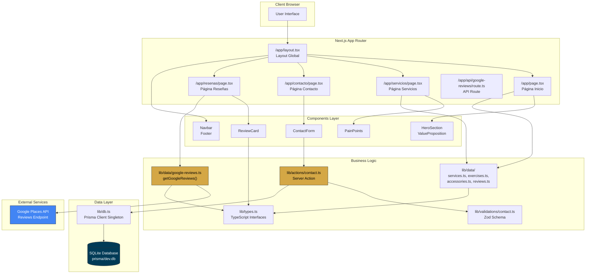
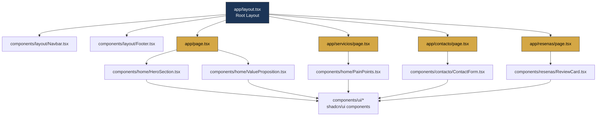
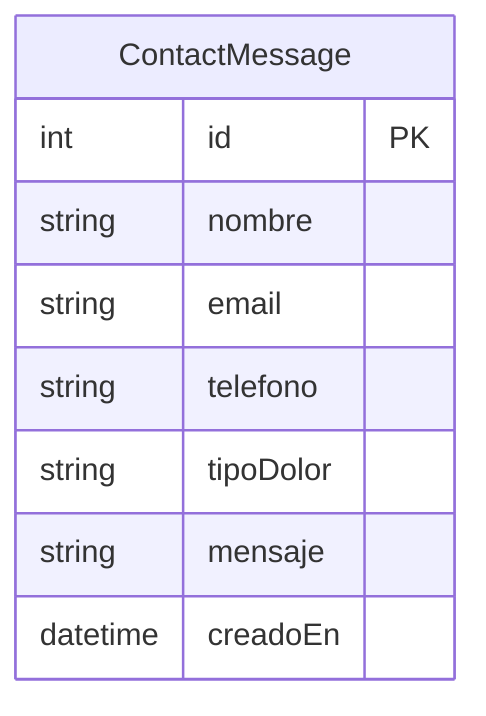

# Health-Control Web

Aplicación web para servicios de salud y bienestar especializados en osteopresión.

## 📋 Tabla de Contenidos

- [Descripción General](#descripción-general)
- [Características](#características)
- [Arquitectura](#arquitectura)
- [Tecnologías](#tecnologías)
- [Instalación](#instalación)
- [Desarrollo](#desarrollo)
- [Testing](#testing)
- [Estructura del Proyecto](#estructura-del-proyecto)

## 📖 Descripción General

Health-Control Web es una aplicación multi-página construida con Next.js 14+ (App Router) que presenta servicios de salud y bienestar especializados en osteopresión. La aplicación ofrece:

- Información sobre tratamientos de osteopresión
- Formulario de contacto con persistencia en base de datos
- Sistema de reseñas integrado con Google Places API
- Diseño moderno con colores de marca (#f7f3ec beige, #1c3557 azul oscuro, #d4a745 dorado)

**Estado del proyecto:** 🚧 En desarrollo activo

> Este proyecto fue desarrollado con [Kiro](https://kiro.dev/) (agente de IA de AWS), siguiendo GitFlow y Conventional Commits.

## ✨ Características

- ⚡ **React Server Components** (RSC) como arquitectura principal
- 🎨 **Diseño personalizado** con colores de marca y efectos visuales modernos
- 🌙 **Dark mode** con next-themes y toggle en la navbar
- 📱 **Diseño responsive** con Tailwind CSS
- 🗄️ **Persistencia de datos** con Prisma ORM + SQLite
- ✅ **Validación de formularios** con Zod
- 🧪 **Property-Based Testing** con fast-check
- ♿ **Accesibilidad** con componentes shadcn/ui
- 🔍 **SEO optimizado** con Metadata API de Next.js
- 🌐 **Integración con Google Places API** para reseñas en tiempo real

## 🏗️ Arquitectura

### Core
- **[Next.js 14.2](https://nextjs.org/)** - React framework con App Router
- **[React 18](https://react.dev/)** - Librería de UI
- **[TypeScript 5](https://www.typescriptlang.org/)** - Tipado estático

### Estilos y UI
- **[Tailwind CSS 3.4](https://tailwindcss.com/)** - Framework de utilidades CSS
- **[shadcn/ui](https://ui.shadcn.com/)** - Componentes accesibles y personalizables
- **[Lucide React 0.383](https://lucide.dev/)** - Iconos

### Base de Datos y Validación
- **[Prisma ORM 5.14](https://www.prisma.io/)** - ORM para TypeScript
- **[SQLite](https://www.sqlite.org/)** - Base de datos local (desarrollo)
- **[Zod 3.23](https://zod.dev/)** - Validación de schemas

### Testing
- **[Vitest 4.1](https://vitest.dev/)** - Framework de testing
- **[fast-check](https://fast-check.io/)** - Property-based testing
- **[Testing Library](https://testing-library.com/)** - Testing de componentes React

### Herramientas de Desarrollo
- **[Kiro](https://kiro.dev/)** - Agente de IA para desarrollo asistido (AWS)
- **ESLint** - Linting de código
- **Prettier** - Formateo de código


## 🚀 Instalación

### Prerrequisitos

- Node.js 18+ 
- npm o yarn

### Pasos de Instalación

1. **Clonar el repositorio**

```bash
git clone https://github.com/Leonela88/Health.Control.git
cd Health.Control
```

2. **Instalar dependencias**

```bash
npm install
```

3. **Configurar variables de entorno**

Crea un archivo `.env` en la raíz del proyecto:

```bash
DATABASE_URL="file:./dev.db"
GOOGLE_PLACES_API_KEY=tu_api_key_aqui
```

> **Nota:** 
> - Para producción, configura una base de datos PostgreSQL o MySQL modificando `DATABASE_URL`
> - Obtén tu Google Places API Key en [Google Cloud Console](https://console.cloud.google.com/)

4. **Inicializar la base de datos**

```bash
npx prisma migrate dev
```

Esto creará:
- La base de datos SQLite en `prisma/dev.db`
- Las tablas necesarias según el schema de Prisma
- El Prisma Client generado

5. **Verificar la instalación**

```bash
npm run dev
```

La aplicación estará disponible en [http://localhost:3000](http://localhost:3000)

## 💻 Desarrollo

### Comandos Disponibles

```bash
# Iniciar servidor de desarrollo
npm run dev

# Construir para producción
npm run build

# Ejecutar build de producción
npm start

# Ejecutar linter
npm run lint

# Ejecutar tests
npm test

# Ejecutar tests en modo watch
npm run test:watch

# Abrir Prisma Studio (visualizador de BD)
npx prisma studio
```

### Flujo de Trabajo Git

Este proyecto sigue **GitFlow**:

- `main` → Rama de producción (solo recibe merges desde `develop`)
- `develop` → Rama de integración y desarrollo
- `feature/nombre-feature` → Ramas para nuevas funcionalidades
- `fix/nombre-fix` → Ramas para correcciones de bugs

**Conventional Commits:**

```bash
feat: añadir formulario de contacto
fix: corregir validación de email
docs: actualizar README
style: formatear código con prettier
test: añadir property tests para ServiceCard
```

## 🧪 Testing

El proyecto utiliza **property-based testing** con fast-check para validar propiedades de corrección.

### Ejecutar Tests

```bash
# Ejecutar todos los tests
npm test

# Ejecutar tests en modo watch
npm run test:watch

# Ejecutar tests con cobertura
npm run test:coverage
```

### Propiedades de Corrección Validadas

1. ✅ Landing muestra al menos 3 beneficios
2. ✅ ServiceCard contiene campos obligatorios
3. ✅ AccessoryCard contiene campos obligatorios
4. ✅ Validación rechaza campos vacíos
5. ✅ Validación de formato de email
6. ✅ Persistencia round-trip de ContactMessage
7. ✅ ReviewCard renderiza todos los campos requeridos
8. ✅ Toggle de dark mode es idempotente y reversible

### Colores de Marca

```css
/* Brand Colors */
--beige-bg: #f7f3ec;      /* Fondo principal */
--dark-blue: #1c3557;     /* Texto principal */
--soft-gold: #d4a745;     /* Acentos y detalles */
--gold-hover: #c19639;    /* Hover states */
```

## 🛠️ Tecnologías

### Diagrama de Flujo de Datos



### Flujos de Datos Principales

#### 1️⃣ Flujo de Reseñas (Google Places API)
```
Google Places API → getGoogleReviews() → ResenasPage → ReviewCard → Browser
```

**Detalles técnicos:**
- Fetch server-side desde `lib/data/google-reviews.ts`
- Sin CORS issues (llamada desde servidor Next.js)
- Caché de 24h con `next: { revalidate: 86400 }`
- Fallback a reseñas placeholder si falla

#### 2️⃣ Flujo de Contacto (Server Action + Prisma)
```
ContactForm → Server Action → Zod Validation → Prisma Client → SQLite → Response
```

**Detalles técnicos:**
- Progressive Enhancement con `useFormState`
- Validación con Zod schema
- Persistencia en tabla `contact_messages`
- Revalidación de path después de crear

#### 3️⃣ Flujo de Datos Estáticos
```
Static Data Files → Page Components → UI Components → Browser
```

**Detalles técnicos:**
- Datos de servicios, ejercicios y accesorios en `lib/data/`
- Renderizado en build time (SSG)
- Sin llamadas a base de datos

### Estructura de Componentes



### Base de Datos (Prisma + SQLite)



**Schema Location:** `prisma/schema.prisma`  
**Database File:** `prisma/dev.db` (SQLite)  
**ORM Client:** `lib/db.ts` (Prisma Client Singleton)

## 🛠️ Tecnologías

```
Health.Control/
├── .kiro/                    # Configuración de Kiro (specs, workflows)
│   └── specs/
│       └── health-control-web/
├── app/                      # App Router de Next.js
│   ├── api/
│   │   └── google-reviews/
│   │       └── route.ts      # API route para Google Places (no usado actualmente)
│   ├── contacto/
│   │   └── page.tsx          # Página de contacto
│   ├── servicios/
│   │   └── page.tsx          # Página de servicios
│   ├── resenas/
│   │   └── page.tsx          # Página de reseñas
│   ├── fonts/                # Fuentes Geist
│   ├── layout.tsx            # Layout global con Navbar y Footer
│   ├── page.tsx              # Página de inicio
│   ├── globals.css           # Estilos globales y variables CSS
│   ├── error.tsx             # Error boundary
│   └── not-found.tsx         # Página 404
├── components/               # Componentes de React
│   ├── home/                 # Componentes del landing
│   │   ├── HeroSection.tsx
│   │   ├── ValueProposition.tsx
│   │   ├── PainPoints.tsx
│   │   └── __tests__/        # Property-based tests
│   ├── contacto/
│   │   └── ContactForm.tsx   # Formulario con Server Action
│   ├── servicios/
│   │   ├── AccessoryCard.tsx (legacy - no usado)
│   │   ├── ExerciseSection.tsx (legacy - no usado)
│   │   └── __tests__/        # Property-based tests
│   ├── resenas/
│   │   └── ReviewCard.tsx    # Tarjeta de reseña
│   ├── layout/
│   │   ├── Navbar.tsx        # Navegación con menú móvil
│   │   └── Footer.tsx        # Footer con info de contacto
│   └── ui/                   # Componentes shadcn/ui
│       ├── button.tsx
│       ├── card.tsx
│       ├── input.tsx
│       ├── select.tsx
│       └── textarea.tsx
├── lib/                      # Lógica compartida
│   ├── actions/              # Server Actions
│   │   ├── contact.ts        # Acción de envío de formulario
│   │   └── __tests__/
│   ├── data/                 # Datos estáticos
│   │   ├── services.ts (legacy - no usado)
│   │   ├── exercises.ts (legacy - no usado)
│   │   ├── accessories.ts (legacy - no usado)
│   │   ├── reviews.ts        # Placeholder reviews
│   │   └── google-reviews.ts # Fetch de Google Places API
│   ├── validations/          # Schemas de Zod
│   │   ├── contact.ts
│   │   └── __tests__/
│   ├── db.ts                 # Singleton de Prisma Client
│   ├── types.ts              # Tipos TypeScript compartidos
│   └── utils.ts              # Funciones de utilidad (cn)
├── prisma/
│   ├── schema.prisma         # Schema de base de datos
│   ├── migrations/           # Migraciones SQL
│   │   └── 20260611221725_init/
│   └── dev.db                # Base de datos SQLite (desarrollo)
├── .env                      # Variables de entorno (no commiteado)
├── .env.example              # Template de variables de entorno
├── .gitignore                # Archivos excluidos de Git
├── package.json              # Dependencias del proyecto
├── tsconfig.json             # Configuración de TypeScript
├── tailwind.config.ts        # Configuración de Tailwind
├── vitest.config.ts          # Configuración de Vitest
├── vitest.setup.ts           # Setup global de tests
├── components.json           # Configuración de shadcn/ui
└── README.md                 # Este archivo
```

## 🔒 Seguridad

- Los archivos sensibles (`.env`, `dev.db`) están excluidos en `.gitignore`
- Las variables de entorno NO se commitean al repositorio
- Los mensajes de error no exponen detalles técnicos al usuario
- La validación de entrada se realiza tanto en cliente como en servidor

## 🎨 Colores de Marca

La aplicación utiliza una paleta de colores consistente en todo el diseño:

```css
/* Brand Colors */
--beige-bg: #f7f3ec;      /* Fondo principal */
--dark-blue: #1c3557;     /* Texto principal */
--soft-gold: #d4a745;     /* Acentos y detalles */
--gold-hover: #c19639;    /* Hover states */
```

Estos colores se definen en `app/globals.css` como variables CSS y se aplican de manera consistente en todos los componentes.

## 📄 Licencia

Este proyecto es privado y está bajo desarrollo.

## 👥 Contacto

Para consultas sobre el proyecto, contacta al equipo de desarrollo.

---

**Desarrollado con ❤️ usando Kiro (AWS AI Agent)**
